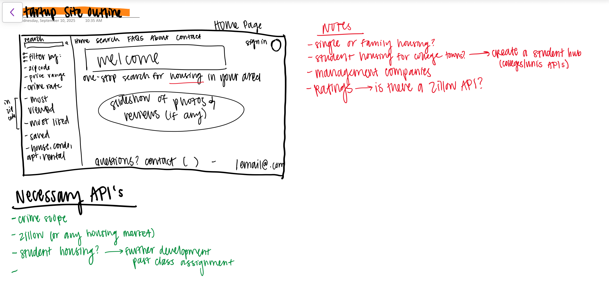
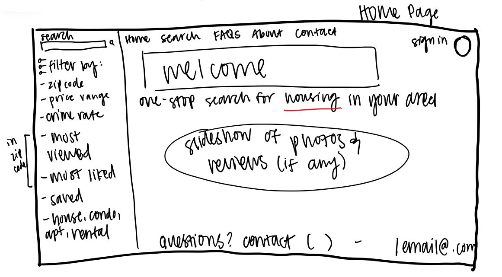
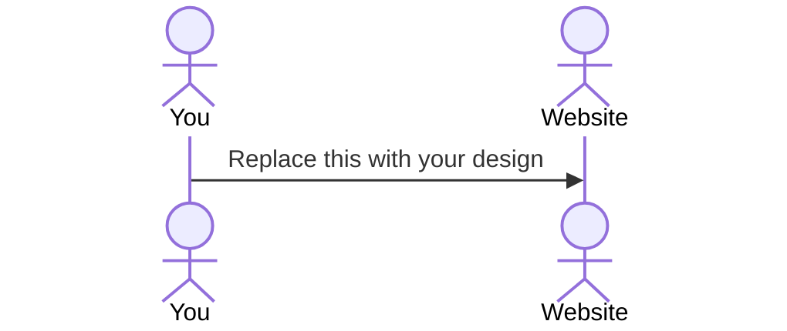

# HomeQuest

This application serves as an example for the information you must provide in your Start Up README.md file for each phase of your development. You only need to fill in the section for the deliverable when you submit that deliverable in Canvas. This allows the TA to know what should be graded. The specification deliverable section defines what your application will do. The rest of the deliverable sections reference the rubric for the deliverable and tell where the functionality is in your application, or documents that you did not satisfy that part of the rubric.

> [!NOTE]
>  If you are not familiar with Markdown then you should review the [documentation](https://docs.github.com/en/get-started/writing-on-github/getting-started-with-writing-and-formatting-on-github/basic-writing-and-formatting-syntax) before continuing.

## 🚀 Specification Deliverable

For this deliverable I did the following. I checked the box `[x]` and added a description for things I completed.

- [x] Proper use of Markdown
- [x] A concise and compelling elevator pitch
- [x] Description of key features
- [x] Description of how you will use each technology
- [x] One or more rough sketches of your application. Images must be embedded in this file using Markdown image references.

### Elevator pitch

Looking for a new home can feel overwhelming—endless scrolling, confusing information, and scattered details about safety and property management. HomeQuest simplifies the search by letting users enter a ZIP code and instantly see houses, condos, apartments, and rentals for sale or lease. Each listing not only displays pricing but also includes area crime rates and direct contact information for the landlord or management company. With real-time updates and a clean, searchable interface, HomeQuest gives people the clarity they need to make confident housing decisions without the hassle of juggling multiple sites.

### Design

Here's a brief sketch of what the Home/Navigation page could look like. Ideas to the side are ideas for future development, assuming the pitch gets investors.

### Key features

- Secure login over HTTPS
- Search properties by ZIP code
- Display pricing, crime rate, and property management/landlord contact info
- Real-time updates when new listings appear in the area (WebSocket)
- Persistent storage of saved searches and favorite properties
- Ability for users to save and revisit favorite listings
- Ability for admins/landlords to add or update listings

### Technologies

I am going to use the required technologies in the following ways.

- **HTML** - Correct structure for login, search page, and results page.
- **CSS** - Responsive styling that works across screen sizes, with clear typography, spacing, and accessible contrast.
- **React** - Components for search bar, property list, property detail, user authentication, and routing between pages.
- **Service** - Backend points for:\
    - login/register
    - retrieving property listings
    - retrieving area crime data (via external API call)
    - saving favorites
- **DB/Login** - Store users, saved properties, and listing details. Credentials securely hashed. Only authenticated users can save favorites or post listings.
- **WebSocket** - Notify users in real time when new listings become available in their searched ZIP codes.

## 🚀 AWS deliverable

For this deliverable I did the following. I checked the box `[x]` and added a description for things I completed.

- [ ] **Server deployed and accessible with custom domain name** - [My server link](https://yourdomainnamehere.click).

## 🚀 HTML deliverable

For this deliverable I did the following. I checked the box `[x]` and added a description for things I completed.

- [ ] **HTML pages** - I did not complete this part of the deliverable.
- [ ] **Proper HTML element usage** - I did not complete this part of the deliverable.
- [ ] **Links** - I did not complete this part of the deliverable.
- [ ] **Text** - I did not complete this part of the deliverable.
- [ ] **3rd party API placeholder** - I did not complete this part of the deliverable.
- [ ] **Images** - I did not complete this part of the deliverable.
- [ ] **Login placeholder** - I did not complete this part of the deliverable.
- [ ] **DB data placeholder** - I did not complete this part of the deliverable.
- [ ] **WebSocket placeholder** - I did not complete this part of the deliverable.

## 🚀 CSS deliverable

For this deliverable I did the following. I checked the box `[x]` and added a description for things I completed.

- [ ] **Header, footer, and main content body** - I did not complete this part of the deliverable.
- [ ] **Navigation elements** - I did not complete this part of the deliverable.
- [ ] **Responsive to window resizing** - I did not complete this part of the deliverable.
- [ ] **Application elements** - I did not complete this part of the deliverable.
- [ ] **Application text content** - I did not complete this part of the deliverable.
- [ ] **Application images** - I did not complete this part of the deliverable.

## 🚀 React part 1: Routing deliverable

For this deliverable I did the following. I checked the box `[x]` and added a description for things I completed.

- [ ] **Bundled using Vite** - I did not complete this part of the deliverable.
- [ ] **Components** - I did not complete this part of the deliverable.
- [ ] **Router** - I did not complete this part of the deliverable.

## 🚀 React part 2: Reactivity deliverable

For this deliverable I did the following. I checked the box `[x]` and added a description for things I completed.

- [ ] **All functionality implemented or mocked out** - I did not complete this part of the deliverable.
- [ ] **Hooks** - I did not complete this part of the deliverable.

## 🚀 Service deliverable

For this deliverable I did the following. I checked the box `[x]` and added a description for things I completed.

- [ ] **Node.js/Express HTTP service** - I did not complete this part of the deliverable.
- [ ] **Static middleware for frontend** - I did not complete this part of the deliverable.
- [ ] **Calls to third party endpoints** - I did not complete this part of the deliverable.
- [ ] **Backend service endpoints** - I did not complete this part of the deliverable.
- [ ] **Frontend calls service endpoints** - I did not complete this part of the deliverable.
- [ ] **Supports registration, login, logout, and restricted endpoint** - I did not complete this part of the deliverable.

## 🚀 DB deliverable

For this deliverable I did the following. I checked the box `[x]` and added a description for things I completed.

- [ ] **Stores data in MongoDB** - I did not complete this part of the deliverable.
- [ ] **Stores credentials in MongoDB** - I did not complete this part of the deliverable.

## 🚀 WebSocket deliverable

For this deliverable I did the following. I checked the box `[x]` and added a description for things I completed.

- [ ] **Backend listens for WebSocket connection** - I did not complete this part of the deliverable.
- [ ] **Frontend makes WebSocket connection** - I did not complete this part of the deliverable.
- [ ] **Data sent over WebSocket connection** - I did not complete this part of the deliverable.
- [ ] **WebSocket data displayed** - I did not complete this part of the deliverable.
- [ ] **Application is fully functional** - I did not complete this part of the deliverable.
